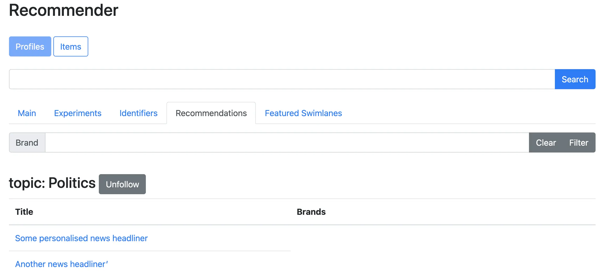

## Portfolio

---

### Personal recommendations

---

### Marketing propensity modelling

---

### FIFA 2018 winner predition

---

### Flight delays prediction

---

### Text mining tool

---

### Experience

[ML Engineer]()
  
Project at DPG Media
Developing real-time personal recommenders and profile services for multiple business use cases at large scale. 
Architecting and building data platforms, data lakes and applications to leverage large amounts and various types of data.

---

[Data Scientist]()
  
Project at Jonhson & Johnson Data Science
Data scientist and ML engineer, responsible for developing healthcare solutions with NLP, text-mining and search tools. 
Building IT architectures and data pipelines in the cloud for a large European big data initiative.

---

### Education

[International Scholarship Chinese Economy - KU Leuven]()

---

[Master of Science in Engineering - KU Leuven]()
Master Electrical Engineering, Major in Embedded Systems and Multimedia

---

[Bachelor of Science in Engineering - KU Leuven]()
Bachelor Electrical Engineering, Minor Business Management

---

### Skills
- Python (Flask, Scikit-Learn, Tensorflow,..), Scala (Spark), JavaScript (Vue.js) 
- Linux, Docker, Kubernetes, CI/CD, Airflow
- AWS, GCP, Terraform
- SQL, SPARQL, NoSQL
- Tableau, Power BI, Looker, Spotfire
- ElasticStack, Kafka, Snowplow, Google Analytics 
- VBA, Excel, Matlab, Perl, Java, C

---

### Certificates
- AWS Certified Data Analytics - Specialty (AWS)
- AWS Certified Solution Architect - Associate (AWS)
- Machine Learning with Tensorflow on GCP Specialization ( Coursera) Data Engineering with GCP Specialization (Coursera)
- Machine Learning by Andrew Ng, Stanford (Coursera)
- Data Scientist (Datacamp)

---
